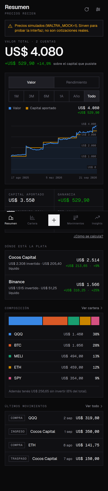
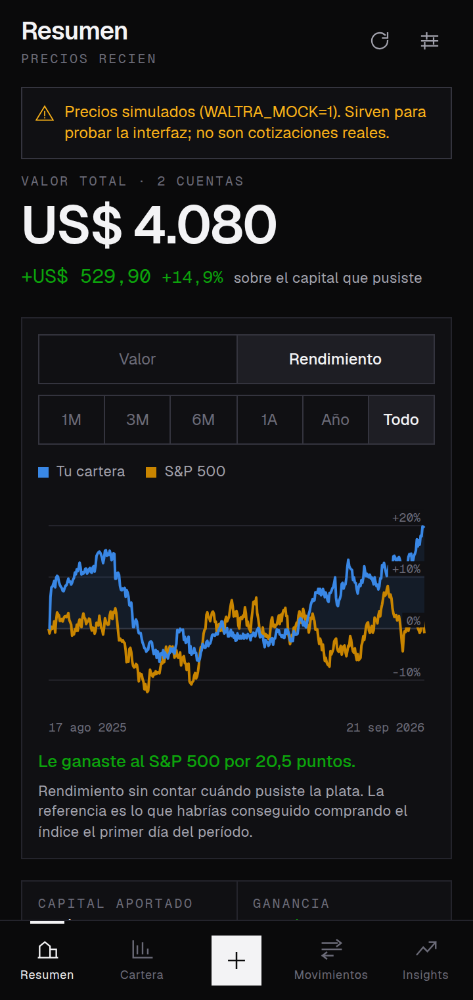
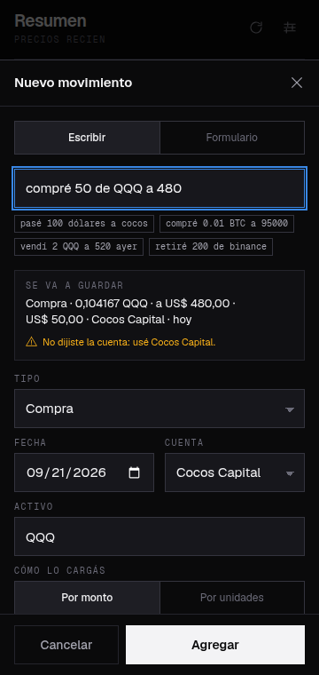
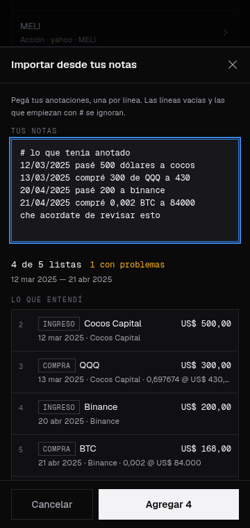
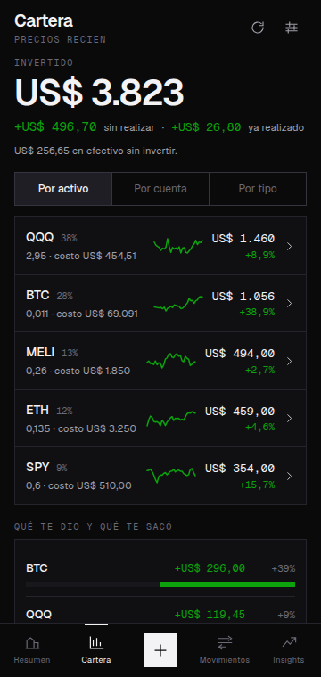
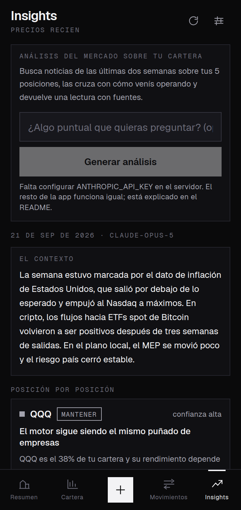

# Waltra

Seguimiento unificado de inversiones en **Cocos Capital** y **Binance**, pensado
para usarse desde el teléfono.

La idea que ordena todo lo demás: **el capital que ponés no es ganancia**. Los
gráficos de los brokers mezclan las dos cosas, y cada transferencia nueva
aparece como si la cartera hubiera crecido. Acá son dos líneas separadas, y la
distancia entre ellas es —literalmente— lo que ganaste.

<p>
  
  
  
  
  
  
</p>

<sub>Las capturas usan la cartera de ejemplo con precios simulados — de ahí el
cartel amarillo. Con precios reales ese aviso no aparece.</sub>

## Qué hace

- **Cargás como si escribieras una nota.** `pasé 100 dólares a cocos`,
  `compré 50 de QQQ a 480`, `vendí 2 QQQ a 520 ayer`, `retiré 200 de binance`.
  La app muestra lo que entendió antes de guardar, y se corrige de un toque.
- **Traés tu historia de una.** Si ya venías anotando en un bloc de notas,
  pegás el archivo entero: la app lee línea por línea, te muestra lo que
  entendió, marca lo que no cierra y carga todo junto. La cuenta se arrastra
  entre líneas, como cuando escribís.
- **El historial de Binance, de una.** Ajustes → Tus datos → *Importar el
  historial de Binance* toma la exportación de órdenes spot tal como sale del
  exchange: lee las ejecutadas, omite las canceladas, rechaza los pares que no
  cotizan contra dólares en vez de anotarlos mal y muestra todo antes de
  guardar. Cada orden se guarda con su número, así que volver a exportar dentro
  de unos meses reemplaza las que ya están y no duplica nada. Como esa
  exportación no trae ingresos ni retiros de dinero, la app dice cuánto capital
  consumieron las órdenes y ofrece anotarlo, con el monto y la fecha editables.
  Cocos no tiene exportación: eso va a mano o pegado desde tus notas.
- **Una sola cartera.** Cocos y Binance en la misma vista, con el detalle por
  cuenta cuando lo querés.
- **Precios al día.** Acciones y ETFs (Yahoo Finance), cripto (Binance), mercado
  local y CEDEARs (data912 / BYMA) y dólar MEP. Si algo no cotiza, la app te lo
  dice, te lleva al activo y podés probar el símbolo contra el proveedor antes
  de guardar.
- **Métricas que no mienten:**
  - *Capital aportado*: ingresos menos retiros. Las transferencias entre tus
    cuentas no cuentan como capital nuevo.
  - *Ganancia*: valor actual menos capital aportado.
  - *Rendimiento real (TWR)*: encadena los retornos diarios neutralizando los
    aportes. Contesta "qué tan bien elegí", sin que el momento en que pusiste
    la plata ensucie el número.
  - *TIR anual (XIRR)*: lo mismo pero desde tu bolsillo, anualizado.
  - Volatilidad anualizada y peor caída desde un pico.
- **¿Le ganaste al índice?** El gráfico tiene dos modos: *Valor* (cartera
  contra capital aportado) y *Rendimiento* (tu TWR contra un índice de
  referencia, configurable: S&P 500, Nasdaq, Bitcoin u oro). Abajo, la
  conclusión en una línea: «Le ganaste al S&P 500 por 20,5 puntos».
- **Reconciliar con el broker.** Tocás una cuenta y ves su detalle. Si el
  efectivo que muestra Cocos o Binance no coincide con el de la app (una
  comisión que no cargaste, el interés de la cuenta remunerada, un redondeo),
  ponés el número real y se carga la diferencia como un ajuste explícito, que
  cuenta como resultado y no como capital. Queda anotado: no se disimula.
- **Insights con IA.** Busca noticias recientes sobre tus posiciones, las cruza
  con cómo venís operando y devuelve una lectura con fuentes citadas. Hay dos
  informes: el de tu cartera y un resumen de mercado que además sale a buscar
  afuera qué podría interesarte. Se pueden agendar —«resumen de mercado los
  lunes a las 9»— y a esa hora llega un recordatorio. Funciona con **Claude o
  con Gemini**, a elección: Gemini tiene nivel gratuito. Requiere tu propia
  clave; sin ella el resto de la app funciona igual.
- **Y si no tenés clave de API**, hay un tercer camino: la app arma el pedido
  completo para copiar, lo pegás en el chat que uses (un abono de Claude o de
  ChatGPT no da acceso por API, pero sí a mano) y traés la respuesta de vuelta.
  Acepta el JSON estructurado o texto suelto.
- **Todo vive en tu teléfono.** IndexedDB, sin cuenta ni servidor propio. Backup
  y restauración a un archivo JSON que es tuyo.
- **Instalable y offline.** Es una PWA: se agrega a la pantalla de inicio y abre
  sin conexión (lo único que no anda sin internet es traer precios nuevos).
- **Y también es un APK.** Empaquetada con Capacitor, sin cuentas ni servidor:
  la instalás y anda. En esa versión la clave de Anthropic la cargás vos desde
  Ajustes y no sale del teléfono.
- **Alertas de precio** (solo en el APK). Waltra mira los precios con la
  pantalla apagada y te avisa cuando algo se mueve más de lo que pediste:
  umbral general, excepciones por activo, umbral de la cartera entera, resumen
  diario a la hora que elijas y una franja de no molestar.

## Arrancar

```bash
npm install
npm run dev
```

Abrí `http://localhost:3000`. La primera vez podés cargar datos de ejemplo para
ver cómo se comporta con historia real antes de meter los tuyos.

### Desde el celular

Tres caminos. El primero es el que probablemente quieras.

**a) El APK.** Es una app de verdad: se instala y listo, sin servidor, sin
cuenta y sin que nadie tenga que dejar la compu prendida. Es además la única
versión con alertas de precio.

Lo compila GitHub Actions en cada push, porque hace falta el SDK de Android, y
lo publica en un enlace fijo:

**https://github.com/mjlascar/Waltra/releases/download/apk-latest/waltra.apk**

Ese enlace siempre apunta a la última compilación. Se abre desde el navegador
del teléfono, baja el APK directo (sin zip y sin estar logueado) y se puede
pasar por WhatsApp a quien quieras.

1. Abrí el enlace en el celular.
2. Instalalo. Android va a pedirte permitir instalar desde esa app (el
   navegador o el explorador de archivos); es el paso normal para algo que no
   viene de Play.
3. Abrila, y si querés insights andá a *Ajustes → Tu clave de Anthropic*.

También queda como artefacto en la pestaña **Actions**, pero ahí viene en un
zip, pide estar logueado y no se puede bajar desde la app de GitHub del
celular. El release existe justamente para evitar las tres cosas.

Para compilarlo en tu propia máquina hace falta el SDK de Android y JDK 21:

```bash
npm run apk    # deja android/app/build/outputs/apk/debug/app-debug.apk
```

#### Antes de repartirlo: firmá con tu propia clave

Android identifica una app por su paquete **y su firma**. Si dos APK del mismo
paquete vienen firmados distinto, el segundo no se instala encima del primero:
hay que desinstalar, y desinstalar **borra todos los movimientos**.

Sin una clave propia configurada, CI genera una descartable en cada corrida.
O sea: el APK que baja de Actions sirve para probar, pero no para actualizar
algo que ya venías usando. El artefacto se llama `waltra-apk-firma-descartable`
justamente para que se note, y el log deja una advertencia.

Se arregla una sola vez, con un comando:

```bash
./scripts/firma.sh
```

Genera la clave en `~/waltra-firma/` y deja los cuatro valores listos para
pegar en *Settings → Secrets and variables → Actions* del repo:
`ANDROID_KEYSTORE_BASE64`, `ANDROID_KEYSTORE_PASSWORD`, `ANDROID_KEY_ALIAS` y
`ANDROID_KEY_PASSWORD`. A partir de ahí CI firma con esa clave, el artefacto
pasa a llamarse `waltra-apk` a secas y las actualizaciones se instalan encima,
conservando los datos.

El script se niega a escribir adentro del repositorio y se niega a pisar una
clave que ya exista: las dos cosas terminan igual de mal, una publicando la
clave y la otra perdiéndola.

**Guardá el `waltra.keystore` en otro lado también y no lo pierdas.** Si se
pierde, la única salida es desinstalar y volver a empezar.

**La primera actualización después de configurar esto todavía pide
desinstalar**, porque la versión instalada está firmada con la clave
descartable de su compilación. Exportá el backup antes (Ajustes → Tus datos →
Exportar) e importalo después. De ahí en adelante, nunca más.

El `versionCode` sale del número de corrida de CI, así que cada build es más
nuevo que el anterior y Android lo acepta como actualización.

**b) Solo en tu red, sin desplegar nada.** Levantás el server en tu compu y
entrás desde el celular:

**a) Solo en tu red, sin desplegar nada.** Levantás el server en tu compu y
entrás desde el celular:

```bash
npm run build && npm start     # escucha en 0.0.0.0:3000
```

Entrá desde el teléfono a `http://<ip-de-tu-compu>:3000` y agregala a la
pantalla de inicio. Anda offline una vez instalada, pero para refrescar
precios la compu tiene que estar prendida.

**c) Desplegada, para tenerla siempre.** Es una app Next.js común, así que
anda tal cual en Vercel, Railway, Fly o un VPS con Node:

1. Subí el repo a GitHub (ya está) e importalo en Vercel.
2. En *Settings → Environment Variables* cargá `ANTHROPIC_API_KEY` si querés
   los insights, y `WALTRA_ACCESS_KEY` con una frase cualquiera para que las
   rutas `/api` no queden abiertas a internet.
3. Entrá desde el celular, andá a *Ajustes → Acceso a la API* y pegá esa misma
   frase. Queda guardada en el teléfono.
4. *Agregar a la pantalla principal* y listo.

Tus movimientos **no** viajan al servidor en ninguno de los tres casos: viven
en el teléfono. El servidor solo busca precios y, si se lo
pedís, genera los insights.

> Si desplegás, hacé backup desde Ajustes igual: los datos siguen atados a
> este navegador, no al deploy.

**Sobre los insights en un plan gratuito:** el análisis hace varias búsquedas
web y puede tardar más de un minuto. Si tu hosting corta las funciones a los
60 segundos (Vercel Hobby, por ejemplo), va a fallar con un mensaje que te lo
dice. Salidas: elegir Sonnet o Haiku desde *Ajustes → Insights*, o correr la
app en tu red, donde no hay límite.

## Configuración

Copiá `.env.example` a `.env.local`. Todo es opcional.

| Variable | Para qué |
|---|---|
| `ANTHROPIC_API_KEY` | Habilita Insights con Claude. Se lee **solo en el servidor**: nunca viaja al navegador. La sacás de [console.anthropic.com](https://console.anthropic.com/) y se paga por uso. Sin esta variable, el resto de la app funciona igual. |
| `GEMINI_API_KEY` | Lo mismo con Gemini, que **tiene nivel gratuito** con cupo diario. La sacás de [aistudio.google.com](https://aistudio.google.com/). Alcanza con una de las dos. |
| `WALTRA_MODEL` | Modelo por defecto del servidor. Desde Ajustes se elige proveedor y modelo sin redesplegar; cualquier valor fuera de la lista blanca se ignora. |
| `WALTRA_ACCESS_KEY` | Si publicás la app en internet, exige esta clave en las rutas `/api`. La cargás una vez en Ajustes y queda en el teléfono. |
| `WALTRA_MOCK` | `1` usa precios simulados para probar la interfaz. La app lo avisa en pantalla con un cartel. |

En el APK no hay servidor, así que ninguna de estas variables aplica: la clave
de Anthropic la cargás desde *Ajustes* y se guarda en el almacenamiento privado
de la app, que Android no deja leer a otras apps. No se vuelve a mostrar, no
entra en el backup y el backup automático de Android está apagado por lo mismo.
Cada uno usa su propia clave y paga lo suyo.

> Este repositorio es público: `.env` y `.env.local` están en `.gitignore` y
> ninguna clave se commitea. `.env.example` va siempre con los valores vacíos.

## Cómo se calcula

Los números salen de `src/lib/engine`, que son funciones puras sobre la lista de
movimientos. Están cubiertas por tests (`npm test`).

**Tipos de movimiento.** La distinción que hace que todo lo demás cierre:

| Tipo | Efecto |
|---|---|
| `deposit` / `withdraw` | Capital externo. Mueve "capital aportado". **No** es resultado. |
| `buy` / `sell` | Interno: cambia efectivo por activo. No toca el capital aportado. |
| `transfer` | Entre tus cuentas. No es capital nuevo, solo cambia dónde está la plata. |
| `dividend` / `interest` | Resultado cobrado en efectivo. Suma ganancia, no capital. |
| `fee` | Costo. |

**Costo de las posiciones:** promedio ponderado, con la comisión incorporada al
costo. Una venta realiza resultado contra ese promedio.

**TWR (rendimiento real):** se encadenan los retornos diarios con el flujo
asentado al cierre del día:

```
r = (valor_hoy − flujo_hoy) / valor_ayer − 1
```

Es decir: la plata que depositás hoy no rindió hoy. Con la convención opuesta,
un aporte hecho el mismo día que el mercado se mueve diluye el retorno de ese
día y el número deja de ser comparable.

**TIR (XIRR):** Newton-Raphson con bisección de respaldo sobre los flujos
externos más el valor actual como flujo final.

**Pesos y dólares:** la base es USD. Los movimientos en pesos se convierten al
MEP de esa fecha (o al que cargues a mano en la operación, que tiene prioridad).

**Cuando falta un precio**, la posición se valúa al costo y la app lo dice en
pantalla. Preferimos subestimar antes que inventar.

## Estructura

```
src/
  app/                 Páginas (Resumen, Cartera, Movimientos, Insights, Ajustes)
    api/               market · health · insights · parse (solo modo web)
  components/
    charts/            Gráficos SVG propios, sin librería
    ui/                Primitivas: hoja inferior, campos, métricas
  lib/
    backend/           Elige entre las rutas /api y correr todo en el teléfono
    engine/            Ledger, valuación diaria, TWR, XIRR, riesgo
    market/            Proveedores de precios + simulador
    parse/             Frases en castellano rioplatense y el historial de Binance
    alerts/            Plan de alertas y puente a las preferencias de Android
    db.ts              IndexedDB (Dexie), backup e importación
    store.tsx          Estado de la app y sincronización
public/
  runners/alerts.js    El vigía de precios: corre fuera del WebView
android/               Proyecto Capacitor (el APK)
```

### Los dos modos

El mismo código corre en dos envoltorios. La decisión se toma **al compilar**,
no al ejecutar, así el empaquetador borra el camino que no corresponde:

| | Web | APK |
|---|---|---|
| Mercado e insights | las rutas `/api` | el mismo código, en el teléfono |
| HTTP a los proveedores | desde el servidor | puente nativo, que no tiene CORS |
| Clave de Anthropic | del entorno del servidor | la carga el usuario |
| Alertas de precio | no hay | sí |

Las pantallas hablan con `src/lib/backend/` y no saben cuál de los dos es.

## Diseño

Modo oscuro único, ángulos rectos en todo, tipografía neutra y números
monoespaciados. La referencia es una terminal de mercado, no una app de
finanzas con degradés.

La paleta de datos está **validada**: banda de luminosidad, piso de croma,
separación para daltonismo (protan/deutan/tritan) y contraste ≥ 3:1 contra la
superficie oscura. El orden de los colores es parte de la garantía, así que no
se cicla ni se reordena. Ninguna información depende del color solo: siempre hay
signo, etiqueta o ícono al lado.

## Cómo se prueba

```bash
npm run check   # tipos + lint + tests + escaneo de credenciales
```

- **238 tests** del motor de cálculo, el parser, la base local, el formato, los
  proveedores de precios, la ruta de insights y el vigía de precios. Los
  proveedores y el SDK corren simulados: son servicios externos que no se
  pueden alcanzar desde CI, y son justamente los que más conviene tener
  fijados. El vigía se prueba cargando **el archivo exacto que viaja en el
  APK** en un contexto con las funciones globales de Android simuladas, no una
  copia en TypeScript que podría irse separando.
- **`npm run e2e`**: 72 comprobaciones sobre un navegador real, en un viewport
  de 360×760 (Galaxy S10e), con la app levantada. Carga movimientos
  escribiendo, edita, borra, filtra, arrastra la cruceta del gráfico, importa
  un bloc de notas, reconcilia un saldo y exporta un backup. Falla si aparece
  cualquier error en la consola del navegador.
- **`npm run pwa`**: contra un build de producción, verifica manifest, íconos,
  service worker y que la app abra y acepte movimientos **con la red cortada**.
- **`npm run native`**: sirve la exportación estática que va adentro del APK
  como archivos sueltos, igual que el WebView, y la recorre en el navegador.
  No prueba los plugins nativos (para eso hace falta un Android de verdad),
  pero sí que la app arranca sin servidor, que las pantallas del modo teléfono
  están y que no queda ninguna llamada a `/api`.

Todo corre en CI en cada push, incluida la compilación del APK.

```bash
npm run dev              # desarrollo
npm run build            # build de producción (web)
npm run build:native     # exportación estática + copia al proyecto Android
npm run apk              # lo anterior + compila el APK (necesita el SDK)
npm run shoot            # capturas de todas las vistas
npm run docs:shots       # regenera las imágenes del README
node scripts/icons.mjs   # regenera los íconos de la PWA
```

## Límites conocidos

- Los datos viven en este teléfono. Si borrás los datos de la app o cambiás de
  equipo, se pierden: **hacé backup desde Ajustes**. El backup automático de
  Android está apagado a propósito, porque subiría tus movimientos y tu clave
  a Google Drive.
- Las fuentes de precios son APIs públicas gratuitas y sin garantía de
  disponibilidad. Ajustes → Diagnóstico dice cuál está caída.
- El MEP histórico viene de una fuente pública; para operaciones viejas en pesos
  conviene cargar el dólar de esa operación a mano.
- El costo es promedio ponderado, no FIFO. Para impuestos puede no coincidir.
- Los insights son una lectura generada por un modelo a partir de búsquedas
  públicas. No es asesoramiento financiero.
- **Las alertas dependen de Android, no de Waltra.** El intervalo que se pide
  es un pedido, no una promesa: el sistema decide cuándo despertar la app y
  nunca lo hace más seguido que cada 15 minutos. En los Samsung conviene sacar
  a Waltra de *Ajustes → Batería → Apps en suspensión*, o se van a espaciar
  solas. No sirven para operar al segundo; sirven para enterarte.
- La app tiene un solo usuario por teléfono y no hay cuentas ni sincronización
  entre equipos. Pasar la cartera a otro teléfono es exportar e importar el
  backup.
